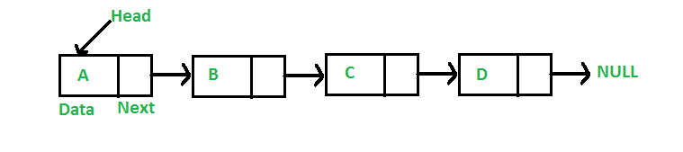

# 陣列(Array)

## 定義(Definition)

### Linked List 是一種線性資料結構：
- 節點（Node）在記憶體中**不連續**
- 每個節點包含：
  - 資料（data）
  - 指向下一個節點的指標（pointer）

## Visualization


## 基本操作(Functions)
- **Create()**:建立空串列
- **IsEmpty(L)**:判斷是否為空
- **Retrieve(L, p)**:取得第 p 個位置的資料
- **Insert(L, p, x)**:在位置 p 插入x
- **Delete(L, p)**:刪除位置 p 的節點
- **Update(L, p, x)**:更新資料
- **Search(L, x)**:搜尋資料位置

## Linked List 種類(Variations)

### Singly Linked List
- 單向
- 記憶體較省
- 無法反向走訪

### Doubly Linked List
- 每個節點有 prev 與 next
- 可雙向 traversal
- 插入 / 刪除更彈性
- 記憶體開銷較大
```c
[prev | data | next]
```
### Circular Linked List
- 最後一個節點指回 head
- 沒有 NULL
- 常見於：
 - Round-robin 排程
 - Playlist / Queue

## Array vs Linked List
| 類別 | Array | Linked List |
| --- | --- | --- |
| **記憶體** | 連續 | 不連續 |
| **大小** | 固定 | 動態 |
| **存取** | O(1) | O(n) |
| **插入/刪除** | O(n) | O(1)已知節點位置 |
| **Cache** | 佳 | 較差 |

## 時間複雜度(Time complexity)

| 操作 |複雜度|
| --- | --- |
| **Access** | O(n) |
| **Insert at head** | O(1) |
| **Insert after known node** | O()1 |
| **Insert at tail** | O(1) / O(n)|
| **Delete at head** | O(1) |
| **Delete known node** | O(1) |
| **Delete by value / position** | O(n) |
| **Search** | O(n)|