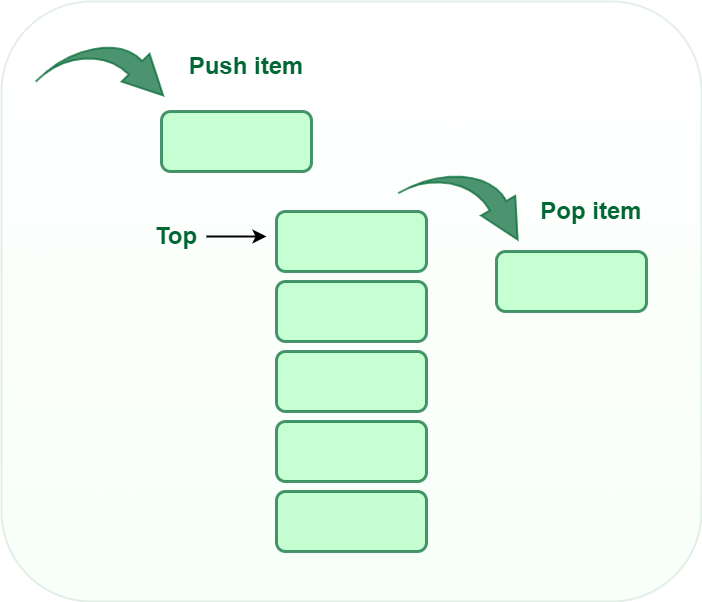
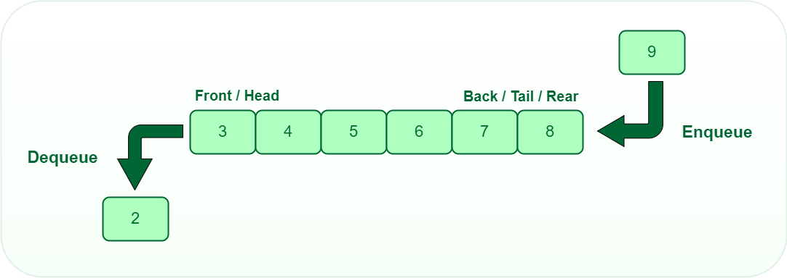

# 堆疊佇列(Stack&Queue)

## 堆疊(Stack)

- 堆疊(Stack)堆疊是一種線性的資料結構。
- 遵循 後進先出(Last-In-First-Out)原則，最後加入的元素會最先被移除 。

## Visualization

## 抽象資料型別(ADT)
- **Top()/Peek()**：查看頂端元素
- **Push()**:將元素加入頂端。
- **Pop()**:移除並回傳頂端元素。

## 時間複雜度(Time complexity)

| 操作 |複雜度|說明|
| --- | --- | --- |
| **Push** | O(1) | 更新top並寫入值 |
| **Pop** | O(1) | 讀取值並遞減top索引 |
| **Top/Peek** | O(1) | 直接取得前端元素值 |

## 應用(Applications)
- 瀏覽器歷史紀錄(Back/Forward)：當你點擊上一頁時，瀏覽器會從堆疊中取出最近訪問的網址。
- 編輯器的撤銷/重做(Undo/Redo)：每次操作都會被推入堆疊，按下 Ctrl+Z 時，系統會彈出最後一次的操作進行撤回。
- 函式調用堆疊(Function Call Stack)：在程式執行(尤其是遞迴)時，系統會用堆疊來追蹤每個函式的回傳位址與區域變數。

## 佇列(Queue)

- 佇列(Queue)堆疊是一種線性的資料結構。
- 遵循 先進先出(First-In-First-Out)*原則，最先加入的元素最先被服務 。

## Visualization

## 抽象資料型別(ADT)
- **Enqueue()**： 將元素加入佇列尾端。
- **Dequeue()**:移除並回傳佇列前端的元素。
- **Front()/Peek()**:查看佇列前端的元素。

## 時間複雜度(Time complexity)

| 操作 |複雜度|說明|
| --- | --- | --- |
| **Enqueue** | O(1) | 在rear處存取值並更新位置 |
| **Dnqueue** | O(1) | 在front處移除元素並更新位置 |
| **Front/Peek** | O(1) | 直接取得前端元素值 |

## 應用(Applications)
- CPU 排程(CPU Scheduling):作業系統使用佇列來管理待處理的進程（例如：輪轉排程法Round-Robin）。
- 圖形的廣度優先搜尋(BFS):在遍歷圖形結構時，佇列用來依序儲存鄰近的節點，確保由近及遠地搜尋。
- 任務管理系統：例如非同步處理任務或訊息隊列，確保任務按請求順序執行。
- 列印工作管理(Print Spooling)：多個文件發送到印表機時，會排成佇列，先傳送的文件先列印。
- GUI 系統中的事件處理:當你快速點擊滑鼠或輸入文字時，作業系統會將這些事件放入佇列中，程式再依序處理。

