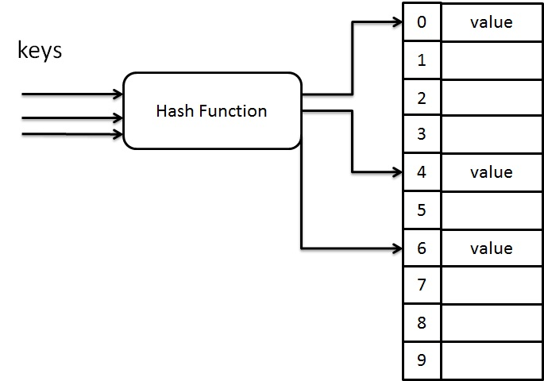

# 雜湊表(Hash Table)

## 定義(Definition)

Hash Table(雜湊表)是一種資料結構，利用 Hash Function(雜湊函數)將KeY轉換成陣列的索引位置，用來儲存與查找Key–Value Pair。
### 目的:
- 不需要逐一搜尋所有資料
- 在平均情況下，可在 O(1) 時間內完成搜尋、插入與刪除

## Visualization

## 基本概念(Key Concepts)
- **Key** : 用來查找資料的識別值
- **Value** : 實際儲存的資料內容
- **Hash Function** : 將 Key 轉換成陣列索引的函數
- **Bucket** : Hash Table 中的陣列位置
- **Collision** : 不同的 Key 對應到同一個 Bucket
- **Load Factor (α)** : α = n / m（資料筆數 / Table Size）

## 雜湊函數(Hash Function)
### 必要特性
1.  **Efficient**
2.  **Uniform**：Key 能平均分散在各個 Bucket
3.  **Deterministic**：同一個 Key 永遠得到相同 Index

### 常見 Hash Function 方法
- **Division Method**: h(k) = k mod m
- **Multiplication Method**: floor(m × (kA mod 1))，A 常取 0.618
- **Folding Method**: 將 Key 分割後加總再取 mod式。

## 碰撞(Collision)
### Collision 定義
- 不同的 Key，經過 Hash Function 後，得到相同的 Index

## 碰撞解決(Collision Handling Methods)

### Separate Chaining
- Bucket 存 Linked List
- 缺點:α 大時效能下降

### Open Addressing
- 使用 Probing 找空位
- 缺點:對 Load Factor 敏感

## Probing Techniques

### Linear Probing
- 公式:(h(k) + i) mod m
- 優點:實作最簡單
- 缺點:Primary Clustering

### Quadratic Probing
- 公式:h(k) + c₁i + c₂i²
- 優點:減少群聚
- 缺點:可能探測不到所有位置(Secondary Clustering)

### Double Hashing
- 公式:h₁(k) + i×h₂(k)
- 優點:分布最平均
- 缺點:計算較複雜
 
 ## 群聚(Clustering)

-**Primary Clustering**
  - 發生於 Linear Probing
  - 連續位置被占用，導致效能下降

- **Secondary Clustering**
 - 發生於 Quadratic Probing
 - 相同 h(k) 的 Key 走相同探測路徑

## 時間複雜度(Time Complexity)

| 操作 | Average | worst |
| --- | --- | --- |
| **Search** | O(1) | O(n) |
| **Insert** | O(1) | O(n)|
| **Delete** | O(1)| O(n) |

## 應用(application)
- Dictionary（單字 → 解釋）
- DNS Caching（Domain → IP）
- Database Index（Primary Key → Record）