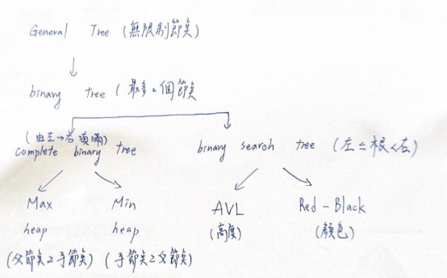

# 樹(Tree)

## 定義(Definition)

**樹(Tree)**是一種**非線性(Non-linear)**的資料結構，用來表示**階層式(Hierarchical)**關係
- **節點(Node)**與**邊(Edge)**組成
- 不存在 cycle
- 常用於表示具有上下層關係的資料

## Tree的基本組成(Components)
- **(Node)**：節點
  - root :根節點
  - leaf :葉節點
- **Edeg**：節點之間的連線
- **Depth / Height**：深度/高度
- **Level**：節點所在層級
- **Subtree**：子樹
- **Fan-out(degree)**：子節點數量

## Tree 的種類（Types of Trees）
### **General Tree**:每個節點可以有**任意數量的子節點**
 ```c
    A
  / | \
 B  C  D
      / \
     E   F
```

### **Binary Tree**：每個節點**最多2個子節點**
```c
         9
        / \
       3  20
      / \  \
     1  10  40
        / \ / \
       4 18 5 45
```
### **Binary Search Tree（BST）**：左 < 根 < 右
```c
            9
           / \
          3   20
         / \  / \
        1  4  10 40
            \     \
            18    45
             /
            5   
```
### **AVL**:任一節點：| 左高 − 右高 | ≤ 1
```c
           10
           / \
          3   20
         / \  / \
        1   5 18 40
           / \    \
           4  9    45
             
              
```
### **Red-Black**:
  - Root 必為黑色
  - 紅色節點不能相鄰
  - 任一路徑的黑色節點數相同
```c
           10(B)
           /  \
       (R)3    20(R)
       /   \    /  \
    (B)1 (B)5 18(B) 40(B)
           / \       \
        (R)4  9(R)   45(R)
                           
```
## Tree 家族的演化（Conceptual Hierarchy）


## 表示法(Representation)
- List Representation
- Left Child – Right Sibling Representation
- Degree-Two Tree Representation
> General Tree 可透過Left Child – Right Sibling 轉成 Binary Tree

## 樹走訪(Graph Traversal)
### Depth-First Traversal
| 類型 | 順序 | 用途|
| --- | --- | --- |
| Preorder | Root → Left → Right | 複製樹 |
| Inorder | Left → Root → Right | BST 排序 |
| Postorder | Left → Right → Root| 刪除 / 釋放記憶體 |

### Breadth-First Traversal
- 使用 Queue(BFT)
- 又稱 Level-order Traversal
- 由上到下、由左到右

## Balanced vs Unbalanced Tree
- Balanced Tree：高度接近 log n
- Unbalanced（Skewed）Tree：退化成類似 Linked List
| 情況 | 時間複雜度 |
| --- | --- |
| Balanced | O(log n) |
| Skewed | O(n) |


## 時間複雜度(Time Complexity)

| 資料結構 | Search | Insert | Delete | 備註  |
| --- | --- | --- |--- |--- |
| **Binary Tree** | O(n) | O(n) | O(n) | 無排序，需遍歷 |
| **BST(最壞)** | O(n) | O(n) | O(n) | Skewed 退化成 Linked List |
| **BST(平均)** |O(log n) |O(log n) | O(log n) | 接近平衡時 |
| **AVL Tree** |O(log n)| O(log n) | O(log n) | 嚴格高度平衡 |
| **Red-Black Tree** | O(log n) | O(log n) | O(log n) | 寬鬆平衡，實務常用 |
| **Heap** | O(n) | O(log n) | O(log n) |Search 無順序 |

